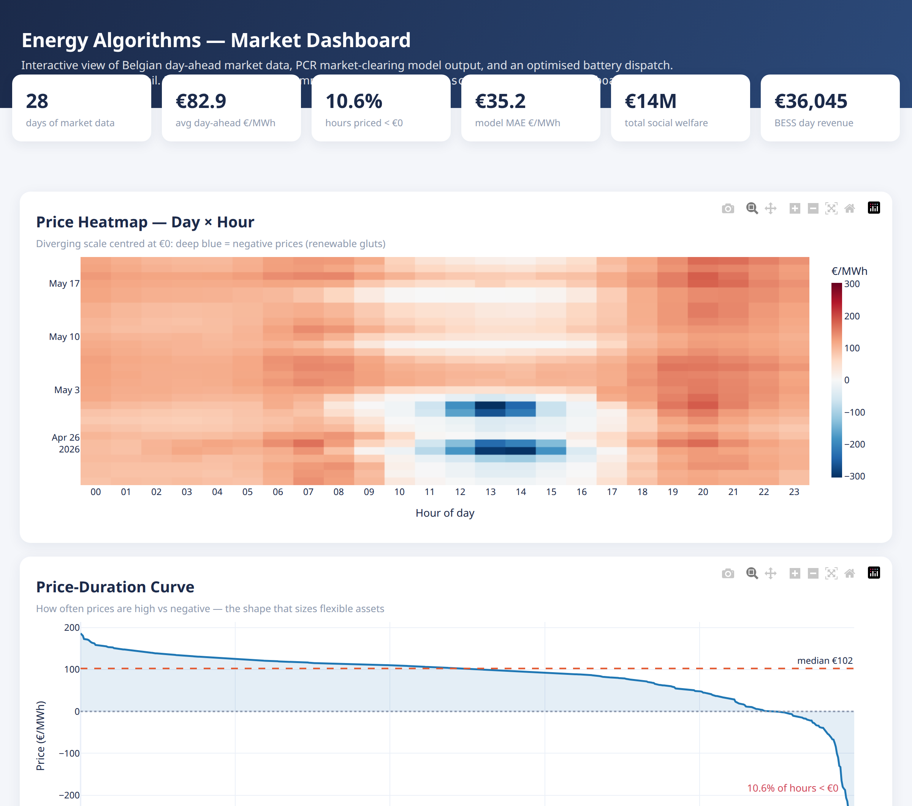
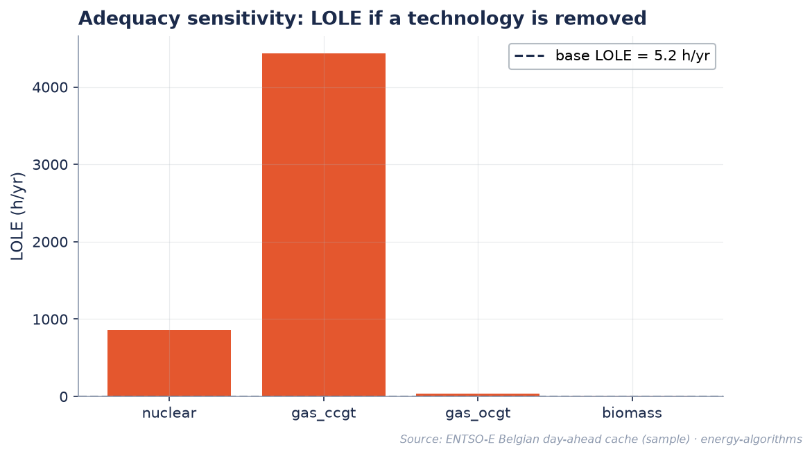
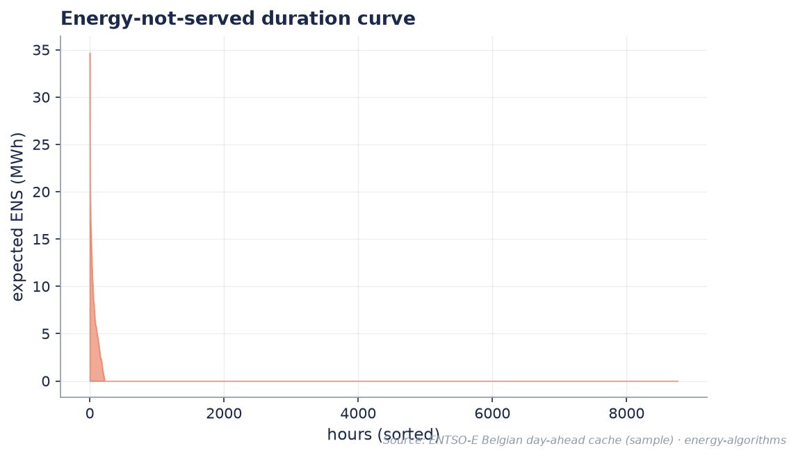
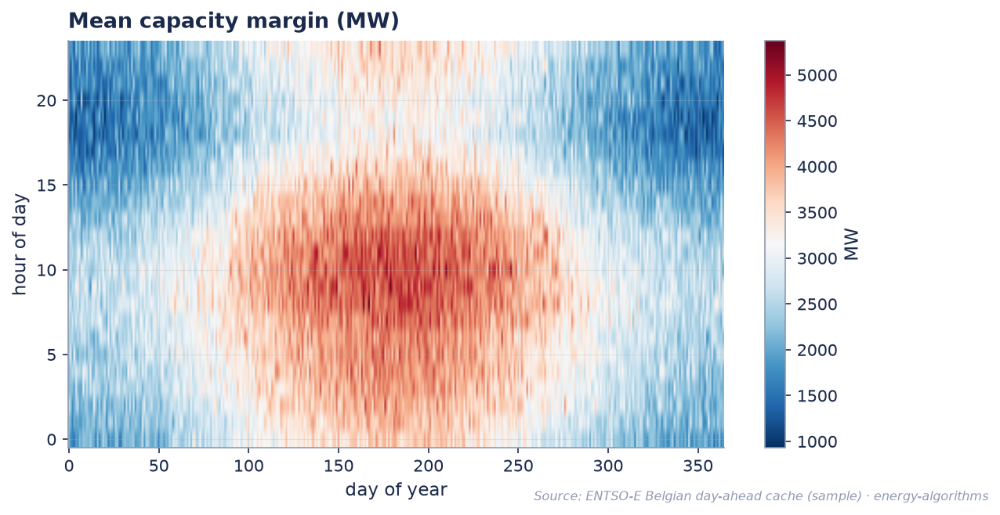
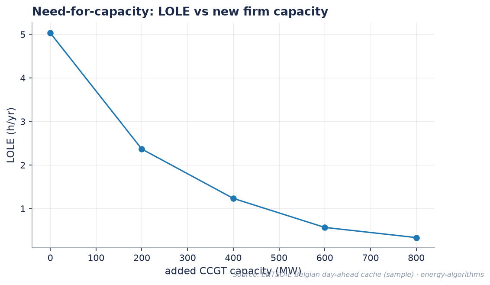

# Energy Algorithms

[](https://github.com/GerasimosG/Energy_Algorithms/actions/workflows/test.yml)
[]()
[](https://www.python.org/)
[](LICENSE)

**Energy domain optimisation portfolio** — social-welfare market clearing (PCR/Euphemia), BESS storage + ancillary services (FCR/aFRR), unit commitment, backtesting. Hexagonal architecture (ports/adapters).

> **Why this repo exists:** I want to show, not tell. Each module corresponds to real-world energy market problems — `domain/markets/pcr_model.py` translates Euphemia-style PCR into a working LP, `domain/optimization/ancillary.py` implements BESS joint FCR+aFRR bidding, `adapters/entsoe_client.py` provides a reliable market data pipeline.

---

## ▶ Interactive dashboard

[](docs/dashboard.html)

A standalone **interactive** Plotly report — six linked panels: price heatmap (day × hour),
price-duration curve, PCR model vs market, social welfare, a **live BESS dispatch** (runs the real
`solve_storage` optimiser on the most volatile day), and the hour-of-day strategy. Hover any chart
for detail. Reproducible from the committed sample dataset — no network, no server.

```bash
# the file is committed — open it directly:
xdg-open docs/dashboard.html        # Linux  ·  macOS: open docs/dashboard.html  ·  Windows: start docs\dashboard.html

# …or rebuild it from the committed sample data:
pip install -e ".[dev]"             # pulls in plotly
python scripts/generate_dashboard.py
```

> GitHub can't render HTML inline, so the image above is a static preview. Clone the repo and open
> [`docs/dashboard.html`](docs/dashboard.html) locally to interact with it.

---

## What it does — at a glance

| Capability | Module | Why it matters |
|---|---|---|
| **Social welfare clearing** (PCR / Euphemia-style) | `domain/markets/pcr_model.py` | Pan-European market coupling. LP with binary block orders, MCP, surpluses |
| **Flow-based market coupling** (FBMC) | `domain/markets/fbmc.py`, `lodf_utils.py` | Real European coupling: PTDF × net position ≤ RAM |
| **Multi-zone ATC coupling** | `domain/markets/multi_zone.py` | Cross-border flows: BE↔FR↔DE↔NL |
| **BESS + FCR + aFRR joint bidding** | `domain/optimization/ancillary.py` | Ancillary services revenue stacking |
| **BESS energy arbitrage** | `domain/optimization/storage.py` | Hour-of-day optimisation; +€58/MWh out-of-sample spread |
| **Unit commitment** (MIP) | `domain/optimization/scheduling.py` | Min up/down, ramps, reserve margin |
| **Continuous intraday order book** | `domain/markets/intraday.py` | Price-time priority, cross-border |
| **7-metric backtesting engine** | `domain/trading/backtest_engine.py` | Sharpe, Sortino, VaR95/99, Calmar, Kelly, MaxDD, CVaR |
| **3 signal strategies** | `domain/trading/` | Hour-of-day, solar duck, calendar spread |
| **ENTSO-E live data + cache** | `adapters/entsoe_client.py` | Real Belgian market data |
| **ML experiment tracking** | `infrastructure/experiment_tracker.py` | Track signal research runs in SQLite |
| **Solver-agnostic core** | `ports/solver.py`, `infrastructure/solver_config.py` | All 11 domain files route through `solve_model()` — swap CBC↔HiGHS↔Gurobi by config |
| **Resource adequacy** (Monte-Carlo) | `domain/adequacy/`, `adapters/antares_io.py` | LOLE / EENS / capacity margin; ANTARES economy I/O; PowerBI star-schema warehouse |

**622 tests passing, 92.83% coverage, 90% gate enforced in CI.** 3 Python versions (3.11/3.12/3.13).

---

## Benchmarks


*Fig 1: Hourly price profiles across 26-day Belgian dataset*


*Fig 2: Daily price trends with volatility bands*


*Fig 3: Hour-of-day strategy profit & loss breakdown*


*Fig 4: Carbon impact analysis — fuel marginal cost vs CO₂ price with the coal→gas switching point*

### Reproducing the visuals

```bash
python scripts/generate_figures.py        # the 4 static PNGs above
python scripts/generate_dashboard.py      # the interactive docs/dashboard.html (see top of README)
```

Both read the small committed sample dataset in [`data/`](data/) via `scripts/_viz_data.py` and share
one visual theme (`scripts/_viz_theme.py`), so every figure and the dashboard reproduce from a fresh
clone.

---

## Resource adequacy & security of supply

A Monte-Carlo resource-adequacy model (2-state forced-outage sampling) computes the standard
security-of-supply metrics on a synthetic one-year fleet: **LOLE** (loss-of-load expectation, h/yr),
**EENS** (expected energy not served, MWh/yr), and the hourly capacity margin / duration curve. The
domain core is pure numpy (`domain/adequacy/`); an ANTARES economy reader (`adapters/antares_io.py`)
ingests `values-hourly.txt`, and a star-schema warehouse (`scripts/build_warehouse.py`) feeds a
PowerBI model documented in [`docs/POWERBI_MODEL.md`](docs/POWERBI_MODEL.md).


*Fig A1: Adequacy sensitivity — LOLE if a technology is removed from the fleet*


*Fig A2: Energy-not-served duration curve — expected ENS by sorted hour*


*Fig A3: Mean capacity margin (MW) across day-of-year × hour-of-day*


*Fig A4: Need-for-capacity — LOLE vs added firm capacity*

```bash
ea-adequacy                                  # Monte-Carlo LOLE/EENS demo (synthetic fleet)
python scripts/_gen_sample_adequacy.py       # regenerate the synthetic sample (seed 42)
python scripts/build_warehouse.py            # build the PowerBI star-schema warehouse
python scripts/generate_adequacy_figures.py  # the 4 static adequacy PNGs above
```

All adequacy figures and metrics come from the committed **synthetic** sample (Monte-Carlo seed 42) —
not real market data. See [`docs/VIZ_BENCHMARK.md`](docs/VIZ_BENCHMARK.md) for the visualization
patterns.

---

## Quick start

```bash
git clone git@github.com:GerasimosG/energy-algorithms-portfolio.git
cd energy-algorithms-portfolio
pip install -e ".[dev]"

# Showcase demos
python -m energy_algorithms.application.markets_demo        # PCR, block orders, FBMC
python -m energy_algorithms.application.optimization_demo   # BESS, UC, FCR+aFRR
python -m energy_algorithms.application.trading_demo        # Backtesting, signals
python -m energy_algorithms.application.energy_data_demo    # ENTSO-E pipeline
python -m energy_algorithms.application.adequacy_demo       # LOLE/EENS Monte-Carlo

# Tests
pytest tests/ -v                                            # 622 tests
pytest tests/ --cov=energy_algorithms --cov-fail-under=90   # coverage gate
```

CLIs after install: `ea-markets`, `ea-optimization`, `ea-trading`, `ea-live`, `ea-experiments`, `ea-adequacy`.

> **Solver note:** PuLP bundles the CBC solver automatically on most platforms. If you hit a solver error, install HiGHS: `pip install highspy`. On Debian/Ubuntu: `sudo apt install coinor-cbc`.

---

## Architecture — hexagonal, solver-agnostic

```
src/energy_algorithms/
├── domain/                ★ pure business logic — no I/O, no solver hardcoding
│   ├── markets/           PCR, FBMC, block orders, intraday, multi-zone
│   ├── optimization/      UC, BESS, ancillary, portfolio, stochastic
│   └── trading/           backtesting, signals, risk metrics
├── ports/                 SolverPort — the solver contract (ABC); adapters implement it
├── adapters/              pulp_solver, entsoe_client, sqlite_store, bt_feeds
├── application/           use-case demos (markets, optimization, trading)
└── infrastructure/        solver_config, experiment_tracker, metadata
```

**Why this matters:** the domain builds each LP/MIP as a PuLP model (PuLP is the modelling DSL) and
routes *solving* through `infrastructure.solver_config.solve_model()`, which delegates to a
`SolverPort` adapter. The default is PuLP/CBC; swap CBC↔HiGHS↔Gurobi with `solver_id="highs"`, or
inject any `SolverPort` via `solver=`. **All 11 domain solve sites go through `solve_model()` →
`SolverPort`**, so the backend is swappable without touching domain logic. The `SolverPort` ABC
(`ports/solver.py`) is the contract; `adapters/pulp_solver.py` is the implementation.

---

## Microservices / infrastructure shipped

| Service | Module | Status |
|---|---|---|
| **Solver service** | `infrastructure/solver_config.py` | ✅ All 11 domain files route through SolverPort |
| **ENTSO-E data caching** | `adapters/entsoe_client.py` | ✅ JSON disk cache with TTL, auto-disabled under pytest |
| **ML experiment tracker** | `infrastructure/experiment_tracker.py` | ✅ SQLite + CLI (`ea-experiments list/show/compare/export`) |
| **Backtesting engine** | `domain/trading/backtest_engine.py` | ✅ 7 risk metrics, walk-forward, signal-shift anti-look-ahead |
| **Coupling utilities** | `domain/markets/coupling_utils.py` | ✅ Shared by 4 market coupling modules |

The first three are the production services a trading desk or optimisation team would actually stand up. They sit behind a `port` (hexagonal) so swapping the implementation (e.g. MLflow for the tracker) is a 1-file change.

---

## Documentation

- **[`docs/BENCHMARK_REPORT.md`](docs/BENCHMARK_REPORT.md)** — comparison vs PyPSA / POMATO / energy-py-linear with 4 plots
- **[`knowledge/`](knowledge/)** — 10-file curriculum: theory, market coupling, UC, storage, backtesting, ENTSO-E

---

## Test status

```bash
pytest tests/ -v --tb=short
# ============= 600 passed, 3 skipped, 0 failed in ~20s ==============
```

```bash
PYTHONPATH="$(pwd)/src" python -m coverage report
# Required test coverage of 90% reached. Total coverage: 92.83%
```

---

## Honest scope

| Built | Not built (and how I'd address in interview) |
|---|---|
| Day-ahead (PCR/FBMC) | mFRR bidding — TSO-specific rules, LP with reserve constraints, would extend `ancillary.py` |
| BESS arbitrage | Real-time telemetry — would add MQTT consumer as new adapter, with pre-approved fallback ramp schedule |
| FCR (symmetric) + aFRR (capacity-only) | Wind/solar stochastic scenarios — already have `stochastic.py` with VSS/EVPI; would add ECMWF ensemble adapter |
| Backtesting (7 risk metrics) | Live execution simulator — would add a "shadow mode" wrapper that runs alongside the trader |
| ENTSO-E data + cache | Production monitoring dashboards — would add Prometheus metrics (P&L, fills, API latency) + Grafana |
| CBC + HiGHS solvers (config) | Gurobi/CPLEX at scale — config-stubs exist; presolve tuning is the gap |

---

## References

- [EUPHEMIA Public Description](https://www.epexspot.com/en/euphemia) — PCR market coupling
- [ENTSO-E SAFA Appendix A](https://www.entsoe.eu/) — ancillary services definitions
- [Elia Ancillary Services](https://www.elia.be/) — Belgian market design
- [Kiesel & Paraschiv (2021)](https://doi.org/) — value of liquidity in intraday reserve markets

## Author

Gerasimos (Gerry) Giachos
